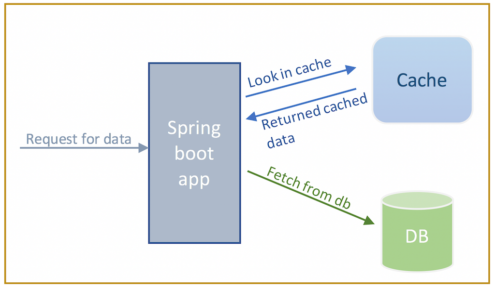

# Spring Data Redis Cache

With this project you'll take a deep dive into the world of caching and explore how to implement Redis cache in a Spring Boot application, 
unlocking its full potential for producing significant performance advantages. 

## Table of contents

- [About the project](#about-the-project)
    * [Built with](#built-with)
- [Getting started](#getting-started)
    * [Prerequisites](#prerequisites)
    * [Installation](#installation)
- [Usage](#usage)
- [Roadmap](#roadmap)
- [License](#license)
- [Acknowledgments](#acknowledgments)

## About the project

This project is developed using a small set of cooperating microservices, composed of three core services: product, review, 
and recommendation. Each of them deals with one type of resource and interacts with a specific database. Additionally, 
there is a composite microservice, called the product composite service, which aggregates information from these three core 
services. All of this information is stored in three different databases, one for each core microservice, and the Spring Data 
project is used to persist data to MongoDB and PostgreSQL databases. Specifically, the product and recommendation microservices
use Spring Data for MongoDB and the review microservice uses Spring Data for the Java Persistence API(JPA) to access a 
PostgreSQL database. In addition, the product composite service interacts with a Redis database used as a cache to store 
the results of database retrieval operations, allowing subsequent requests to retrieve the data directly from the cache. 
This significantly improves application performance by reducing unnecessary database calls.
At the end of this project, we will have layers inside our microservices that will look like the following:

The Protocol layer handles protocol-specific logic. It is very thin, only consisting of the RestController annotations 
in the api project and the common GlobalControllerExceptionHandler in the util project. The main functionality of each 
microservice resides in each Service layer. The product composite service contains an Integration layer used to handle 
the communication with the three core microservices. The core microservices will all have a Persistence layer used for 
communicating with their databases. The cache annotations are integrated into the product composite Service layer, and 
it will invoke the Integration layer only after querying the cache and in case the requested data is not found in the cache. 
In particular when a request is made, the service initially looks in the Redis cache for the desired data. When a cache hit 
occurs, the data is swiftly retrieved from the cache and promptly provided back to the service, avoiding the need to interact 
with the database. However, if the requested data is not found in the cache (cache miss), the service falls back to the database 
to retrieve the required information. Subsequently, the fetched data is stored in the Redis cache, enabling future requests 
for the same data to be served directly from the cache, thereby eliminating further database queries and speeding up overall 
response times.

### Built with

* [![Spring][Spring.io]][Spring-url]
* [![Redis][Redis.io]][Redis-url]
* [![MongoDB][Mongodb.com]][Mongodb-url]
* [![Postgresql][Postgresql.com]][Postgresql-url]
* [![Ubuntu][Ubuntu.com]][Ubuntu-url]
* [![Java][Java.com]][Java-url]
* [![Java][Jetbrains.com]][Jetbrains-url]

## Getting started
### Prerequisites
### Installation

## Usage

## Roadmap

## License

Distributed under the MIT License. See `LICENSE.txt` for more information.

## Acknowledgments

- [Microservices with Spring Boot 3 and Spring Cloud - Third Edition](https://www.packtpub.com/product/microservices-with-spring-boot-3-and-spring-cloud-third-edition-third-edition/9781805128694)
- [Cache Abstraction](https://docs.spring.io/spring-framework/reference/integration/cache.html)
- [Spring Redis Cache](https://docs.spring.io/spring-data/redis/reference/redis/redis-cache.html)

[Spring.io]: https://img.shields.io/badge/Spring-6DB33F?style=for-the-badge&logo=spring&logoColor=white
[Spring-url]: https://spring.io/
[Redis.io]: https://img.shields.io/badge/redis-%23DD0031.svg?&style=for-the-badge&logo=redis&logoColor=white
[Redis-url]: https://redis.io/
[Mongodb.com]: https://img.shields.io/badge/MongoDB-4EA94B?style=for-the-badge&logo=mongodb&logoColor=white
[Mongodb-url]: https://www.mongodb.com/
[Postgresql.com]: https://img.shields.io/badge/PostgreSQL-316192?style=for-the-badge&logo=postgresql&logoColor=white
[Postgresql-url]: https://www.postgresql.org/
[Ubuntu.com]: https://img.shields.io/badge/Ubuntu-E95420?style=for-the-badge&logo=ubuntu&logoColor=white
[Ubuntu-url]: https://ubuntu.com/
[Java.com]: https://img.shields.io/badge/Java-ED8B00?style=for-the-badge&logo=openjdk&logoColor=white
[Java-url]: https://www.java.com/it/
[Jetbrains.com]: https://img.shields.io/badge/IntelliJ_IDEA-000000.svg?style=for-the-badge&logo=intellij-idea&logoColor=white
[Jetbrains-url]: https://www.jetbrains.com/idea/

