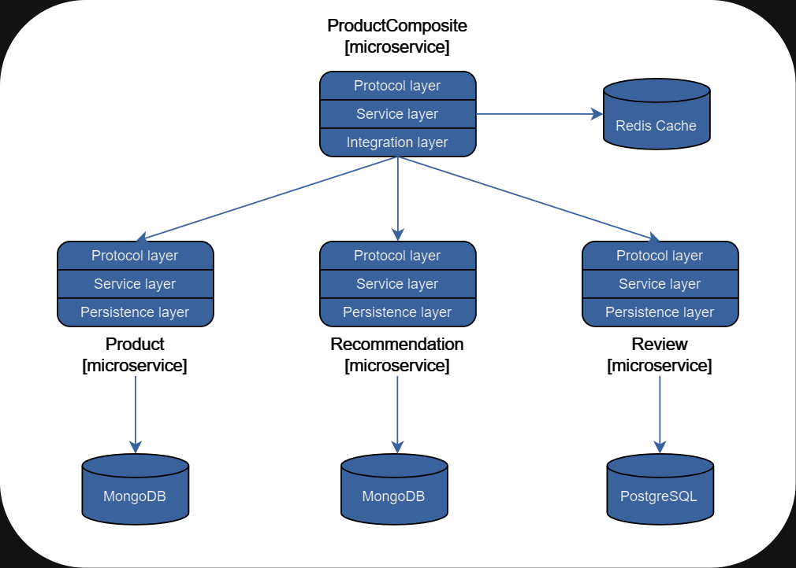

# Spring Data Redis Cache

With this project you'll take a deep dive into the world of caching and explore how to implement Redis cache in a Spring Boot application, 
unlocking its full potential for producing significant performance advantages. 

## Table of contents

- [About the project](#about-the-project)
    * [Built with](#built-with)
- [Getting started](#getting-started)
    * [Prerequisites](#prerequisites)
    * [Installation](#installation)
- [Usage](#usage)
- [Roadmap](#roadmap)
- [License](#license)
- [Acknowledgments](#acknowledgments)

## About the project

To demonstrate how things fit together, I will use a small set of cooperating microservices. It consists of three core microservices, 
the product, review, and recommendation services, all of which deal with one type of resource, and a composite microservice called 
the Product Composite service, which aggregates information from the three core services.

### Built with

* [![Spring][Spring.io]][https://spring.io/]
* [![Redis][Redis.io]][https://redis.io/]
* [![MongoDB][Mongodb.com]][https://www.mongodb.com/]
* [![Postgresql][Postgresql.org]][https://www.postgresql.org/]

## License

Distributed under the MIT License. See `LICENSE.txt` for more information.

## Acknowledgements

- [Microservices with Spring Boot 3 and Spring Cloud - Third Edition](https://www.packtpub.com/product/microservices-with-spring-boot-3-and-spring-cloud-third-edition-third-edition/9781805128694)
- [Cache Abstraction](https://docs.spring.io/spring-framework/reference/integration/cache.html)
- [Spring Redis Cache](https://docs.spring.io/spring-data/redis/reference/redis/redis-cache.html)

